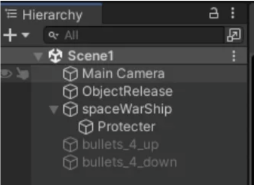

# Hệ thống học trắc nghiệm

Website tĩnh để luyện trắc nghiệm các môn lý luận chính trị. Không cần framework hay bước cài đặt phụ thuộc.

## Kiểm tra logic

Chạy các bài kiểm tra tự động bằng Node.js:

```powershell
node --test tests/*.test.mjs
```

## Chạy website

Mở `index.html` bằng trình duyệt, hoặc dùng một static server (khuyến nghị khi public website).

## Thêm một bộ câu hỏi mới

1. Chép file Markdown vào thư mục gốc, ví dụ `ten-mon.md`.
2. Viết câu hỏi theo mẫu:

   ```md
   Nội dung câu hỏi?
   A. Phương án A
   B. Phương án B
   C. Phương án C
   D. Phương án D
   A
   ```

   Với câu hỏi có code, bọc đoạn code trong dấu ba backtick để web hiển thị đúng thụt lề:

   ````md
   Đoạn code này làm gì?
   ```csharp
   void Start()
   {
       Debug.Log("Hello");
   }
   ```
   A. In Hello ra Console
   B. Thoát game
   A
   ````

   Với câu hỏi cần nhìn ảnh, thêm ảnh vào `assets/` rồi chèn một dòng ảnh Markdown ngay dưới câu hỏi:

   ```md
   What is TRUE about below hierarchy window?
   
   A. Phương án A
   B. Phương án B
   B
   ```

   Số lượng lựa chọn linh hoạt từ `A` đến `Z`. Dòng đáp án có thể viết `A` hoặc `Đáp án: A`; đáp án nhiều lựa chọn dùng dạng `AC`.

3. Chạy:

   ```powershell
   node build_sources.js
   ```

4. Tải lại website. Môn mới sẽ xuất hiện trong danh sách.

Để build lại duy nhất một nguồn sau khi chỉnh Markdown:

```powershell
node build_sources.js ten-mon.md --force
```

### Ẩn / hiện một môn

Thêm hoặc xóa id môn trong `hiddenSources` ở `build_sources.js`, rồi chạy lại `node build_sources.js`. File `.md` và `.js` của môn bị ẩn vẫn được giữ.

> Không chạy `--force` không kèm tên file: các file JavaScript đã tạo sẵn sẽ được giữ nguyên.

## Cấu trúc

- `index.html`: cấu trúc giao diện.
- `styles.css`: toàn bộ giao diện responsive.
- `app.js`: điều phối giao diện, điều hướng và các luồng luyện tập/thi thử.
- `quiz-core.js`: logic thuần cho chuẩn hóa câu hỏi, chấm điểm, tạo phiên luyện tập và trộn dữ liệu.
- `quiz-state.js`: trạng thái khởi tạo của ứng dụng.
- `quiz-storage.js`: đọc/ghi tiến độ trong trình duyệt.
- `tests/quiz-core.test.mjs`: test cho chấm điểm, làm lại câu sai, refresh và kết quả thi.
- `build_sources.js`: pipeline duy nhất để chuyển Markdown thành nguồn câu hỏi JavaScript.
- `sources.js`: danh sách nguồn được tạo tự động.
- `*.md`: dữ liệu gốc có thể chỉnh sửa.
- `*.js` theo tên môn: dữ liệu đã build, được website tải.

## Phím tắt

- `←` / `→`: chuyển câu trước hoặc sau.
- `Space`: hiện hoặc ẩn đáp án đúng ở chế độ luyện tập.
- `1`–`9`: chọn đáp án theo thứ tự hiển thị (`1` = A, `2` = B, …); dùng được ở luyện tập, thi và học cấp tốc.

## Chế độ học cấp tốc

Dùng khi cần ghi nhớ nhanh một môn. Bấm **Học cấp tốc** (có thể chọn khối bắt đầu; mặc định là khối chưa hoàn thành kế tiếp).

- Câu hỏi của môn được chia thành các khối 50 câu theo thứ tự trong đề.
- **Lượt 1:** chọn đáp án cho từng câu; có nút **Không chắc** (phím `0`) để xem ngay đáp án đúng. Câu sai hoặc không chắc được hiển thị đáp án đúng, được ghi nhận và quay lại sau 3–5 câu, lặp lại cho tới khi chọn đúng.
- **Lượt 2:** làm lại toàn bộ khối theo thứ tự xáo trộn, cùng cơ chế quay lại với câu sai. Khối hoàn thành khi mọi câu đã được trả lời đúng ở lượt này.
- Câu chỉ được coi là **đã thuộc** khi đúng ngay lần đầu ở lượt 2; câu sai ở lượt 2 trở thành câu **chưa thuộc**.
- **Ôn dồn:** cứ sau 3 khối (và sau khối cuối cùng), hệ thống ôn lại các câu chưa thuộc của các khối trước. Câu đúng ngay lần đầu được loại khỏi danh sách chưa thuộc.
- Không đảo thứ tự đáp án. Sau mỗi câu (đúng hay sai) cần bấm **Tiếp tục** (hoặc `Enter`, `Space`, `→`). Phím `A`, `B`, `C`… (hoặc `1`, `2`, `3`…) chọn đáp án tương ứng.
- Tiến độ được lưu theo từng môn trong trình duyệt. **Tạm dừng học cấp tốc** giữ nguyên vị trí để học tiếp; **Đặt lại tiến độ học cấp tốc** (trong mục Tùy chọn) xóa toàn bộ.

## Chế độ thi

- Người dùng chọn số câu hỏi (mặc định 60) và khoảng câu "Từ câu … đến câu …". Đề thi lấy ngẫu nhiên, không trùng, từ khoảng đã chọn; số câu không thể vượt quá số câu trong khoảng và sẽ tự giảm theo khoảng.
- Đáp án chỉ được chấm khi bấm **Nộp bài**; điểm được quy đổi về thang 10.
- Có thể làm lại các câu sai nhiều lần. Các vòng làm lại không thay đổi điểm bài thi ban đầu.
- Sau khi nộp bài, có thể làm lại đúng đề đã thi hoặc tạo một đề mới có cùng số câu và khoảng câu.
- Các đề mới ưu tiên không lặp lại các câu bạn đã làm đúng; câu sai hoặc chưa làm vẫn có thể xuất hiện lại để ôn. Khi không còn đủ câu chưa làm đúng để tạo một đề, website sẽ thông báo rồi tự động đặt lại vòng xáo trộn câu hỏi.
- Danh sách ô số câu cho phép nhảy nhanh tới từng câu và theo dõi trạng thái: khi thi chỉ hiển thị đã/chưa trả lời, sau khi nộp bài hiển thị đúng/sai.
- Phiên thi đang làm được lưu trong trình duyệt. Bấm **Kết thúc bài thi** để xóa phiên đó và quay lại chế độ luyện tập.
